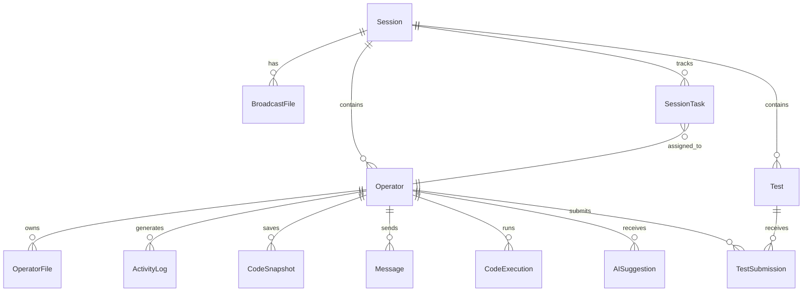

# ZTCE Architecture Deep-Dive

## System Overview

ZTCE is a **distributed, real-time collaborative development platform** designed to operate entirely within air-gapped networks. The architecture consists of four primary layers.

---

## Layer 1: The Sync Engine (ASGI WebSockets)

The heart of ZTCE is its **asynchronous WebSocket layer**, built on Django Channels with ASGI protocol handling.

### How It Works
1. **Connection**: Operators connect to per-session or per-operator WebSocket endpoints
2. **Channel Groups**: Each session and operator maintains a channel group for targeted broadcasting
3. **Event Routing**: Incoming messages are typed (`code_update`, `whiteboard_update`, etc.) and routed to group broadcasts
4. **Persistence**: Code changes are persisted to SQLite with automatic version bumping via `database_sync_to_async`

### Event Types
| Event | Direction | Purpose |
|-------|-----------|---------|
| `code_update` | Bi-directional | Real-time code synchronization |
| `activity_update` | Operator → Session | Traffic-light status broadcasting |
| `whiteboard_update` | Bi-directional | Excalidraw element synchronization |
| `pdf_whiteboard_update` | Bi-directional | Per-page PDF annotation sync |
| `pdf_page_change` | Session-wide | PDF page navigation sync |
| `file_broadcast` | Admin → All | Document distribution notifications |
| `operator_added` | Session-wide | New operator presence alert |
| `ai_status_changed` | Admin → All | AI toggle state propagation |
| `task_updated` | Session-wide | Kanban board real-time updates |
| `admin_code_update` | Admin → Operators | Live code streaming |
| `new_message` | Bi-directional | Encrypted chat messages |
| `broadcast_file_changed` | Session-wide | File toggle notifications |

### Scaling
- **Single server**: InMemoryChannelLayer (zero dependencies)
- **Multi-server cluster**: Redis channel layer for cross-process broadcasting

---

## Layer 2: The Brain (Zero-Trust AI)

### Local Inference Pipeline
```
Operator Code → Prompt Construction → Ollama API → Local Model → Response → Fernet Encrypt → Database
```

### Supported Operations
1. **Code Analysis**: Syntax review, error detection, optimization suggestions
2. **Auto-completion**: Context-aware code completion using local Python introspection
3. **Assessment Generation**: AI-generated tests with automated grading
4. **Code Explanation**: Natural language explanations of code snippets

### Why Zero-Trust?
- Models run on the **same hardware** as the platform
- No API keys for external services required
- All AI responses are **encrypted at rest** before storage
- Session admins can **toggle AI on/off** per session

---

## Layer 3: The Interface (Next.js + React)

### Page Architecture
| Route | Purpose | Key Features |
|-------|---------|-------------|
| `/` | Landing page | Session creation, join flow, network config |
| `/command-center` | Admin dashboard | Real-time monitoring, code viewer, whiteboard, task board |
| `/workspace/[sessionId]/[operatorId]` | Operator IDE | Monaco editor, terminal, AI suggestions, file management |

### Component Library
- **Monaco Editor**: VS Code-grade editing with syntax highlighting for 40+ languages
- **Excalidraw**: Real-time collaborative whiteboard/diagramming
- **xterm.js**: Full terminal emulation in the browser
- **PDF Whiteboard**: Document viewer with per-page annotation overlay
- **Test Creator/Runner**: Assessment creation and submission interface

### Real-Time Architecture
```
React State ← useEffect WebSocket listener
     ↓
User Input → WebSocket.send() → Django Channels → Group Broadcast
     ↓
All Clients ← WebSocket.onmessage → React State Update → Re-render
```

---

## Layer 4: The Delivery (Docker)

### Container Architecture
```
docker-compose.yml
├── ztce-backend     (Python 3.11 + Daphne ASGI)
├── ztce-frontend    (Node 20 + Next.js production)
├── ztce-redis       (Redis 7 Alpine — channel layer)
└── ztce-ollama      (Ollama — local AI inference)
```

### Data Flow
- All containers communicate via **Docker bridge network**
- No container has internet access after build
- Persistent data stored in **named Docker volumes**
- Single-command deployment: `docker-compose up --build`

---

## Database Schema



---

## Performance Characteristics

| Metric | Value |
|--------|-------|
| WebSocket latency (LAN) | < 5ms |
| Code sync round-trip | < 50ms |
| AI suggestion (Ollama, 7B model) | 2-10 seconds |
| Concurrent operators per session | 50+ (InMemory) / 500+ (Redis) |
| Database writes per second | 100+ (SQLite WAL mode) |
| Cold start (Docker) | ~30 seconds |
